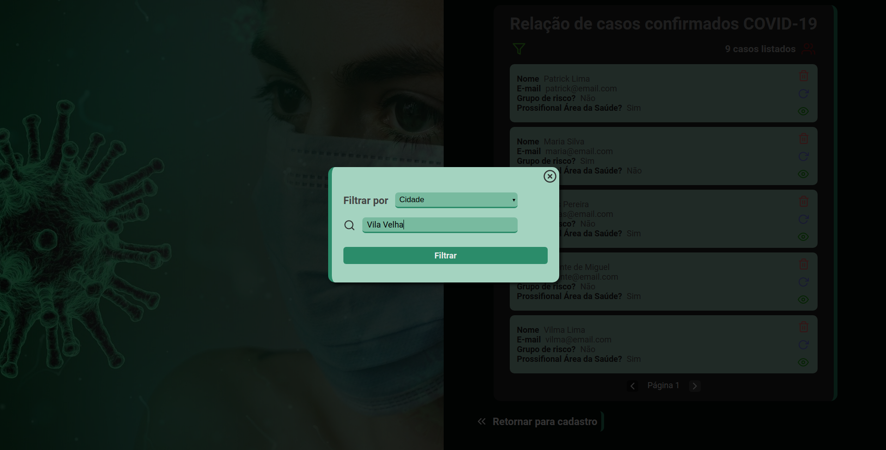
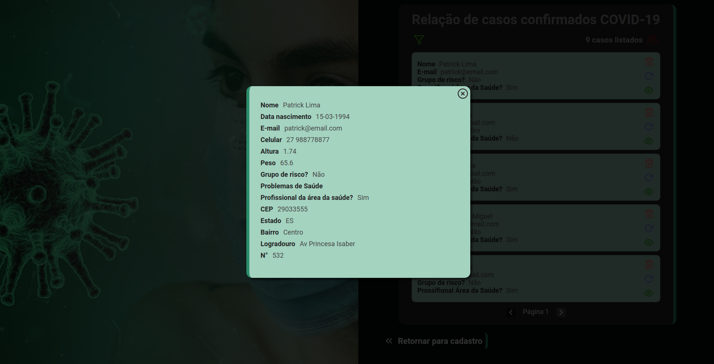

# Projeto Frontend utilizando React e Typescript

### O objetivo deste projeto foi desenvolver uma interface (SPA), que realizasse o CRUD (Create, Read, Update e Delete) dos dados extraídos de uma API que eu desenvolvi em Node 

# Instalando e excutando a aplicação:

- Realizar o clone deste repositório
- Na pasta raiz deste projeto, executar o comando `npm install` ou `yarn`
- Para iniciar a aplicação, executar o comando `npx start` ou `yarn start`

# Principais Depedencias utilizadas

  - `react-icons`: Utilizar icones SVG já estilizados, (Material design Icons, Font Awesome, Bootstrap Icons, Feather, etc)
  - `date-fns`: Para trabalhar de forma mais simples e produtiva com formatação de datas e hora
  - `axios`: Para facilitar as conexoes assíncronas HTTP através de `promisses`
  - `react-loader-spinner`: Componente já estilizado e com animação para _preloader_
  - `react-router-dom`: Para possibilitar a navegação através de rotas
  - `styled-components`: Para estilizar de forma mais altomatizada os componentes
  
# Principais Depedencias desenvolvimento utilizadas

 - `ESLint`: ara correção de erros e padronização do código
 - `Prettier`: Para formatar o código, deixando mais organizado e de simples entendimento

# Prints das telas da aplicação

---

---

---

---

